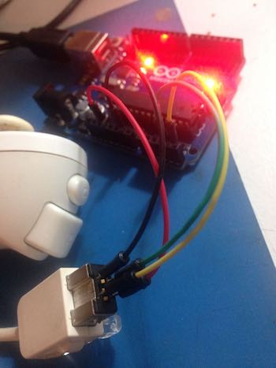

#Processing + Arduino

### An experiment to modify a processing sketch with physical controllers plugged through an Arduino board.

Right now the Arduino board uses a *Wii nunchuk* controller instead of the mouse coordinates. You can check it out in the arduino sketch: `Wiichuck-reader > Wiichuck-reader.ino`

##**How does it work?**

The nunchuck is plugged into the arduino, the sketch is loaded on the board..and it will output X and Y coordantes from the joystick to be used insted of mouse coordinates. The arduino board and the Processing sketch communicate throug the serial port.

:pushpin: I will be updating from with more details...

##**Useful links :raised_hands:**
* [Modify The HC-05 Bluetooth Module Defaults Using AT Commands by Hazim Bitar](http://www.techbitar.com/modify-the-hc-05-bluetooth-module-defaults-using-at-commands.html)
* [Connecting 2 Arduinos by Bluetooth using a HC-05 and a HC-06: Pair, Bind, and Link](http://www.martyncurrey.com/connecting-2-arduinos-by-bluetooth-using-a-hc-05-and-a-hc-06-pair-bind-and-link/)