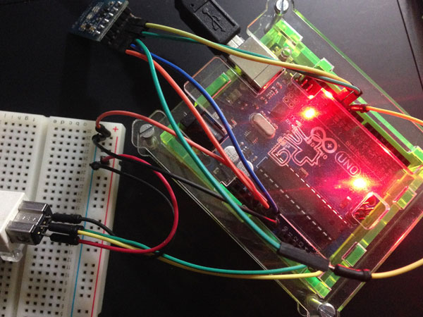
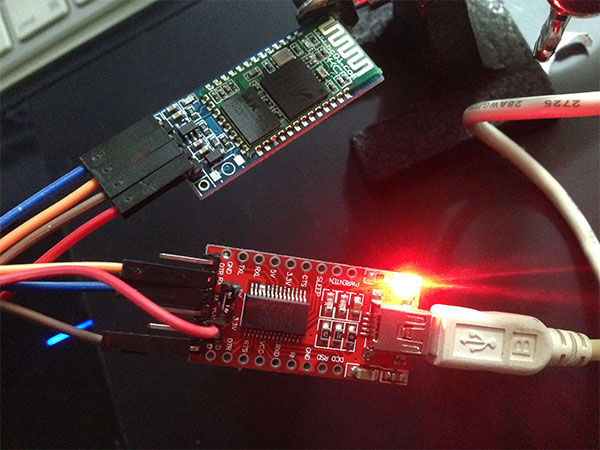

#Processing + Arduino

### An experiment to modify a processing sketch with physical controllers plugged through an Arduino board.

**Different results from the Processing sketch:**

Right now the Arduino board uses a *Wii nunchuk* controller instead of the mouse coordinates. You can check it out in the arduino sketch: `Wiichuck-reader > Wiichuck-reader.ino`

##**How does it work?**

The nunchuck is plugged into the arduino, the sketch is loaded on the board..and it will output X and Y coordantes from the joystick to be used insted of mouse coordinates. The arduino board and the Processing sketch communicate throug the serial port.

:pushpin: I will be updating with more details...

##**Let's take it to the next step..**
**I will be working on setting up two bluetooth modules in order to get this to work wirelessly.**

I'm using:
> * hc-05 bluetooth module
> * hc-06 bluetooth module
> * FTDI FT232 USB- Serial (UART)

The hc-06 modules is plugged into the computer through a FTDI FT232 basic breakout USB- Serial (UART) and the hc-05 is sending data from the Arduino Uno.

**Why?** Using the UART adapter was my idea to make things easier, that way we can continue reading the serial port in our processing sketch. I couldn't find a lot of resources about reading bluetooth incoming data through Processing, If you have any tips I would be happy to hear from you.

Making this work wirelessly is still a project WIP, I'll leave here the resources I found useful to get this setup running. But the final complete project setup isn't done. I will be updating. :speech_balloon:

**hc-05 setup**

**hc-06 setup**

##**Useful links :raised_hands:**
* [Modify The HC-05 Bluetooth Module Defaults Using AT Commands by Hazim Bitar](http://www.techbitar.com/modify-the-hc-05-bluetooth-module-defaults-using-at-commands.html)
* [Connecting 2 Arduinos by Bluetooth using a HC-05 and a HC-06: Pair, Bind, and Link](http://www.martyncurrey.com/connecting-2-arduinos-by-bluetooth-using-a-hc-05-and-a-hc-06-pair-bind-and-link/)